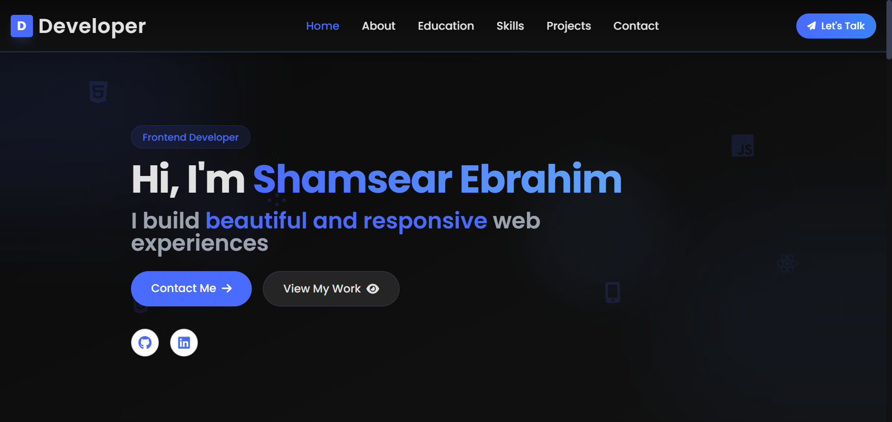

# Frontend Developer Portfolio



## 🚀 Live Demo

Visit the live portfolio: [Your portfolio URL here]

## 📋 Overview

A modern, responsive portfolio website showcasing my skills, projects, and experience as a Frontend Developer. Built with HTML, CSS, and JavaScript with Tailwind CSS for styling.

## ✨ Features

- **Responsive Design**: Fully responsive layout that works on all devices
- **Interactive UI**: Smooth animations and transitions for enhanced user experience
- **Project Showcase**: Filterable projects section to highlight my work
- **Skills Visualization**: Visual representation of technical skills
- **Contact Form**: Integrated contact form using EmailJS
- **Modern Design**: Clean and professional look with subtle animations

## 🛠️ Projects Featured

1. **E-Commerce Website** - Responsive online store with shopping cart functionality
2. **Dashboard UI** - Interactive admin dashboard with data visualization
3. **Social Media App** - Frontend for a social networking platform
4. **Portfolio Website** - Custom portfolio website with animations
5. **Landing Page** - High-converting product landing page

## 💻 Technologies Used

- HTML5
- CSS3
- JavaScript
- React.js
- Tailwind CSS
- SASS/SCSS
- Git & GitHub
- Responsive Design
- API Integration
- Figma/Adobe XD

## 📱 Responsive Design

The portfolio is fully responsive and optimized for:
- Desktop displays
- Tablets
- Mobile devices

## 🔧 Setup and Usage

1. Clone the repository:
   ```
   git clone https://github.com/yourusername/portfolio.git
   ```

2. Open the project folder:
   ```
   cd portfolio
   ```

3. Open `index.html` in your browser or use a local server.

## 📞 Contact

- Email: your.email@example.com
- LinkedIn: [linkedin.com/in/yourusername](https://linkedin.com/in/yourusername/)
- GitHub: [github.com/yourusername](https://github.com/yourusername)

## 📄 License

This project is licensed under the MIT License - see the LICENSE file for details.

---

© 2024 Your Name. All Rights Reserved. 